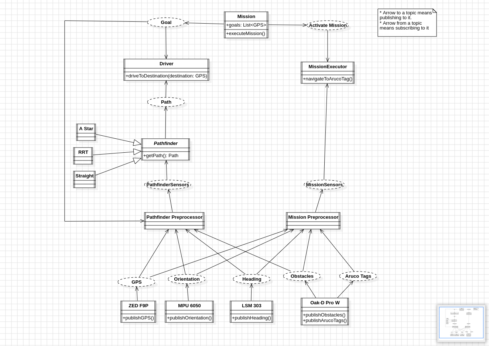

# URC Intelligent Systems 2024

This repository contains the intelligent systems division's modules and sensor logic for SJSU Robotics' latest Mars Rover. It is based on [ROS Humble](https://docs.ros.org/en/humble/index.html).

# Architecture

Below is a diagram depicting the architecture of our `urc_intelsys_2024` package. Sensors (bottom) publish to their individual topics
and are aggregated and preprocessed by the specific preprocessors, which send data to be used higher up in the command chain.

# Getting Started

## Dependencies

To get started, make sure you have ROS Humble installed. You can check out the install instructions available [on the ROS website](https://docs.ros.org/en/humble/Installation.html). You will also need `colcon`, which can be installed according to [this ROS tutorial](https://docs.ros.org/en/humble/Tutorials/Beginner-Client-Libraries/Colcon-Tutorial.html). Finally, make sure that you install all the repository-specific dependencies by running `rosdep install --from-paths src -y --ignore-src`. More details about rosdep can be found on the [ROS rosdep tutorial](https://docs.ros.org/en/humble/Tutorials/Intermediate/Rosdep.html).

## Placing the Repository

This repository is already a [ROS workspace](https://docs.ros.org/en/humble/Tutorials/Beginner-Client-Libraries/Creating-A-Workspace/Creating-A-Workspace.html) with a complete `src` directory. Do not place this repository inside another ROS workspace.

## Repository Structure

The repository is already a ROS workspace. As such, it contains a `src` directory with individual packages `urc_intelsys_2024` and `urc_intelsys_2024_msgs`.

### `urc_intelsys_2024`

This package is a python package and is where most of the code will go. It contains the following directories:

- `launch` - this directory contains scripts that can be run using `ros2 launch urc_intelsys_2024 (script name)`
- `test` - this directory contains tests that can be run using `colcon test`
- `resource` - this directory should only contain the empty file `urc_intelsys_2024`. It is used purely for ROS 2's internals and shouldn't be altered.
- `urc_intelsys_2024` - this directory is where our main codebase resides.

### `urc_intelsys_2024_msgs`

This package contains message definitions. Message definitions allow us to pass structured data over topics.

## Workflow

### Building

From the root of this repository, you can run the following commands to build ROS packages:

- `colcon build` - This builds all packages (both `urc_intelsys_2024_msgs` and `urc_intelsys_2024`)
- `colcon build --packages-select [urc_intelsys_2024_msgs | urc_intelsys_2024]` - This builds only the selected package

### Installing

Once built, there should be an `install` directory present in the root of this repository. Simply run `source install/setup.sh` (or `source install/setup.zsh` if using zshell) to install the built packages.

### Running

After installing, scripts and launch files can be run with `ros2 run` and `ros2 launch`, respectively.

Scripts (entry points defined in `src/urc_intelsys_2024/setup.py`) can be run with `ros2 run urc_intelsys_2024 (entry_point_name)`, to run the Fake GPS publisher, you can run `ros2 run urc_intelsys_2024 fake_gps`. Then, in a separate terminal (after going through the install steps), you can run `ros2 run urc_intelsys_2024 gps_listener` to see the gps outputs.

Launch files (defined in `src/urc_intelsys_2024/launch/*.py`) can be run with `ros2 launch urc_intelsys_2024 (file_name).py`. For example, to run all sensors, you can run `ros2 launch urc_intelsys_2024 sensor_launch.py`. To pass arguments (for example, to specify that all sensors should be fake), you can specify `(argument_name):=(value)`. For example, `ros2 launch urc_intelsys_2024 sensor_launch.py compass_type:=fake gps_type:=fake`. To learn more, see [the ROS documentation](https://docs.ros.org/en/humble/Tutorials/Intermediate/Launch/Creating-Launch-Files.html).

## Contributing

- When contributing a submodule, remember that all submodules must have an `__init__.py` in order to be recognized as a submodule.
- When adding a new node, add its `main` function to the `entry_points` parameter in `setup.py` in the format `(name) = urc_intelsys_2024.(submodule1).(submodule2).(...).(file_name):main`.
